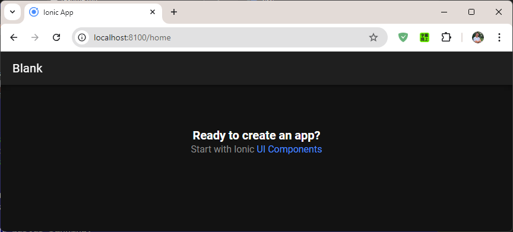
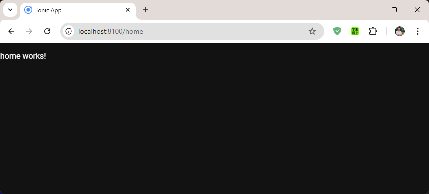
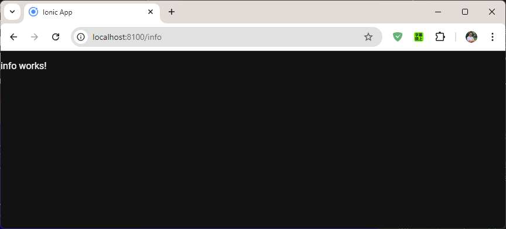
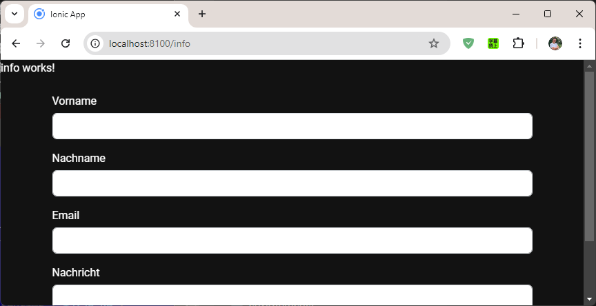
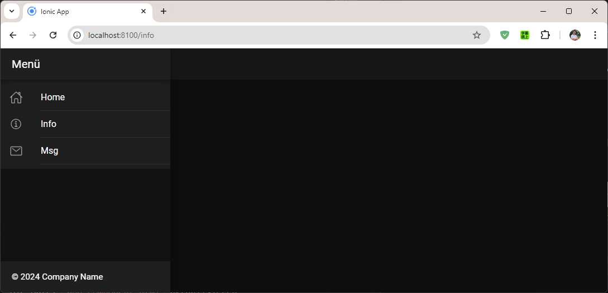
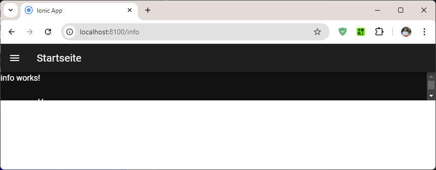
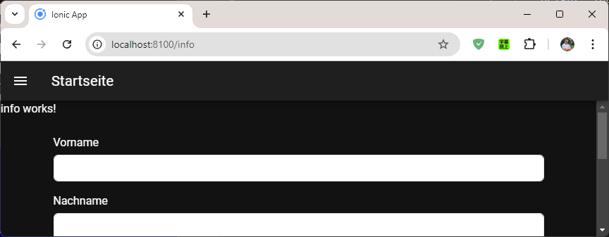
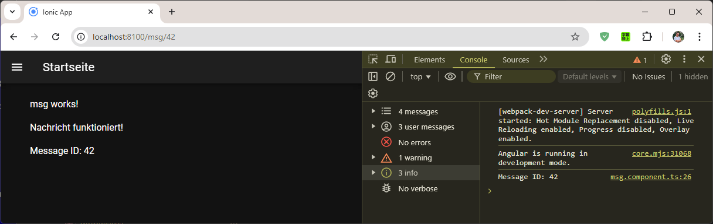

# IonicEinkaufsliste 

mit Ionic, Angular, Bootstrap, Menü, Capacitor

In dieser Anleitung wird beschrieben, wie ein Ionic-Projekt mit Angular  und einer Service-Unterstützung erstellt wird. 



## Voraussetzungen
- Angular CLI muss installiert sein (`npm install -g @angular/cli`).
- Capacitor muss installiert sein


# Anleitung

### 1. Ein neues Ionic-Projekt erstellen

Erstelle ein neues Ionic-Projekt

```terminal
ionic start IonicGrundlagen
```
Framework und Starter-Template auswählen.

- ? Framework: Angular
- ? Starter template: list
- NgModules


Framework auswählen:

```` terminal
Pick a framework!

Please select the JavaScript framework to use for your new app. To bypass this prompt next time,
supply a value for the --type option.

? Framework: (Use arrow keys)
> Angular | https://angular.io
  React   | https://reactjs.org
  Vue     | https://vuejs.org
````

Vorlage auswählen:

```` terminal
Let's pick the perfect starter template!

Starter templates are ready-to-go Ionic apps that come packed with everything you need to build
your app. To bypass this prompt next time, supply template, the second argument to ionic start.

? Starter template: (Use arrow keys)
  tabs         | A starting project with a simple tabbed interface
  sidemenu     | A starting project with a side menu with navigation in the content area
> blank        | A blank starter project
  list         | A starting project with a list
  my-first-app | A template for the "Build Your First App" tutorial
````

NgModules auswählen:

```` terminal
 (Use arrow keys)
> NgModules
  Standalone
````

----


### 2. Projekt Starten

Wechsle dann ins Projektverzeichnis:

```` terminal
cd IonicGrundlagen
````

Öffne das Projekt in Visual Studio Code:

```` terminal
code .
````

Angular Projekt starten und Browser öffnen

```` terminal
ionic serve -open
````

Lokal: http://localhost:8100 


----

### Komponente erstellen

```` terminal
ionic generate component home
ionic generate component info
ionic generate component msg
````

Home Component wird überschrieben. So sieht die Startseite anders aus. 




### app.modules.ts

Alle Komponente sollen impoertiert und unter declarations eingetragen werden:

```` typescript
import { NgModule } from '@angular/core';
import { BrowserModule } from '@angular/platform-browser';
import { RouteReuseStrategy } from '@angular/router';

import { IonicModule, IonicRouteStrategy } from '@ionic/angular';

import { AppRoutingModule } from './app-routing.module';
import { AppComponent } from './app.component';

// EINTRAGEN - Importiere Components
import { MsgComponent } from './msg/msg.component';
import { InfoComponent } from './info/info.component';


@NgModule({
  declarations: [
    AppComponent,

    MsgComponent,  // EINTRAGEN - Deklariere MsgComponent hier
    InfoComponent,  // EINTRAGEN - Deklariere InfoComponent hier

  ],
  imports: [
    BrowserModule, 
    IonicModule.forRoot(), 
    AppRoutingModule,
  ],
  providers: [{ provide: RouteReuseStrategy, useClass: IonicRouteStrategy }],
  bootstrap: [AppComponent],

})
export class AppModule {}

````
----

### app.rounting.module

```` typescript
import { NgModule } from '@angular/core';
import { PreloadAllModules, RouterModule, Routes } from '@angular/router';


// EINTRAGEN
import { HomeComponent } from './home/home.component'; 
import { InfoComponent } from './info/info.component'; 
import { MsgComponent } from './msg/msg.component'; // MsgComponent importieren


const routes: Routes = [

  // EINTRAGEN
  { path: 'home', component: HomeComponent },
  { path: 'info', component: InfoComponent },
  { path: 'msg/:id', component: MsgComponent }, // Route für MsgComponent mit ID

  { path: '', redirectTo: 'home', pathMatch: 'full' },
];


@NgModule({
  imports: [
    RouterModule.forRoot(routes, { preloadingStrategy: PreloadAllModules })
  ],
  exports: [RouterModule]
})
export class AppRoutingModule { }
````
----

## URLs

http://localhost:8100/home

http://localhost:8100/info

http://localhost:8100/msg/42




----

## Bootstrap

Bootstrap installieren:

```` terminal
npm install bootstrap
````

Die Datei `global.scss` aktualisieren:

````scss
/* EINTRAGEN Bootstrap */
@import '~bootstrap/dist/css/bootstrap.min.css';
````

----

## Formular erstellen

Formular in die Datei `info.component.html` einbauen:

```` html
<ion-content>

<p>
  info works!
</p>

<form name="anfrage" class="container mt-4"  (submit)="onSubmit($event)">
  <div class="mb-3">
    <!-- Vorname -->
    <label for="vorname" class="form-label">Vorname</label>
    <input type="text" id="vorname" name="vorname" class="form-control">
  </div>

  <div class="mb-3">
    <!-- Nachname -->
    <label for="nachname" class="form-label">Nachname</label>
    <input type="text" id="nachname" name="nachname" class="form-control">
  </div>

  <div class="mb-3">
    <!-- Email -->
    <label for="email" class="form-label">Email</label>
    <input type="email" id="email" name="email" class="form-control" required>
  </div>

  <div class="mb-3">
    <!-- Nachricht -->
    <label for="nachricht" class="form-label">Nachricht</label>
    <textarea id="nachricht" name="nachricht" class="form-control"></textarea>
  </div>

  <!-- Senden Button -->
  <button type="submit" class="btn btn-primary w-100">Senden</button>
</form>

<br />

</ion-content>
````

Die Logig in die Datei `info.componnet.ts` einbauen:

```` typescript
import { Component, OnInit } from '@angular/core';

// EINTRAGEN
import { FormsModule } from '@angular/forms'; // FormsModule importieren

@Component({
  selector: 'app-info',
  templateUrl: './info.component.html',
  styleUrls: ['./info.component.scss'],
})
export class InfoComponent  implements OnInit {

  constructor() { }

  // EIGENSCHAFTEN
  vorname: string = '';
  nachname: string = '';
  email: string = '';
  nachricht: string = '';

  ngOnInit() {
    console.log('InfoComponent wurde initialisiert');
  }

  //onSubmit() {
  onSubmit(event: Event) { // Event empfangen

    // Verhindere das Standard-Submit-Verhalten (also das Neuladen der Seite)
    event.preventDefault();

    const form = document.forms.namedItem('anfrage');
    
    if (form) {
      this.vorname = (form.elements.namedItem('vorname') as HTMLInputElement).value;
      this.nachname = (form.elements.namedItem('nachname') as HTMLInputElement).value;
      this.email = (form.elements.namedItem('email') as HTMLInputElement).value;
      this.nachricht = (form.elements.namedItem('nachricht') as HTMLTextAreaElement).value;
    }

    console.log('Formular abgeschickt');
    console.log('Vorname:', this.vorname);
    console.log('Nachname:', this.nachname);
    console.log('Email:', this.email);
    console.log('Nachricht:', this.nachricht);

    // Hier kannst du weitere Logik implementieren, z.B. das Senden der Nachricht an einen Server
  }

}
````

Design in die Datei `info.componnet.scss` einbauen:

```` css
  ion-content {
    height: 100%;
    overflow: hidden; // Deaktiviert horizontales Scrollen
  }
````



Scrolbar wird realisiert. 

----

## Menü-Leiste


Die Datei `app.component.html` aktualisieren:

```` typescript
<ion-app>
  
  <ion-menu side="start" menuId="first" contentId="main-content">

    <ion-header>
      <ion-toolbar>
        <ion-title>Menü</ion-title>
      </ion-toolbar>
    </ion-header>

    <ion-content>
      <ion-list>
        <ion-menu-toggle auto-hide="true">
          <ion-item routerLink="/home" routerDirection="root">
            <ion-icon slot="start" name="home-outline"></ion-icon> 
            Home
          </ion-item>
        </ion-menu-toggle>
        <ion-menu-toggle auto-hide="true">
          <ion-item routerLink="/info" routerDirection="root">
            <ion-icon slot="start" name="information-circle-outline"></ion-icon> 
            Info
          </ion-item>
          </ion-menu-toggle>
        <ion-menu-toggle auto-hide="true">
          <ion-item routerLink="/msg/42" routerDirection="root">
            <ion-icon slot="start" name="mail-outline"></ion-icon>
            Msg
          </ion-item>
        </ion-menu-toggle>
      </ion-list>
    </ion-content>

    
    <ion-footer>
      <ion-toolbar>
        <ion-title size="small">© 2024 Company Name</ion-title>
      </ion-toolbar>
    </ion-footer>

  </ion-menu>

  
  <div id="main-content">
    <ion-header>
      <ion-toolbar>
        <ion-buttons slot="start">
          <ion-menu-button></ion-menu-button> <!-- Menü Butonu -->
        </ion-buttons>
        <ion-title>Startseite</ion-title>
      </ion-toolbar>
    </ion-header>

    <ion-content>
      <router-outlet></router-outlet>
    </ion-content>
    
  </div>

</ion-app>
````

Ergebnis




Die Höhe des Content-Bereiches anzupassen, muss in die Datei `app.components.scss` folgende Einstellung eingetragen werden:

```` typescript
  #main-content {
    display: flex;
    flex-direction: column;
    height: 100%;
  }
````

Vorher




Nacher




---- 


## Parameter aus dem URL auslesen

http://localhost:8100/msg/42

Die Datei `msg/msg.component.ts` aktualisieren:

```` typescript
import { Component, OnInit } from '@angular/core';

// EINTRAGEN
import { ActivatedRoute } from '@angular/router';

@Component({
  selector: 'app-msg',
  templateUrl: './msg.component.html',
  styleUrls: ['./msg.component.scss'],
})
export class MsgComponent  implements OnInit {

  //constructor() { }
  
  // EINTRAGEN
  id: string | null = null;

  // EINTRAGEN, ID
  constructor(private route: ActivatedRoute) { }

  ngOnInit() {
    this.route.paramMap.subscribe(params => {
      this.id = params.get('id');
      //this.id = params.get('id') ?? '';  // Falls 'id' nicht gefunden wird, wird ein leerer String zugewiesen
      console.log('Message ID:', this.id);
    });
  }
  
}
````

Die Datei `msg/msg.component.html` aktualisieren:

```` html
<ion-content>

  <div class="container mt-4">
    <p>
      msg works!
    </p>
    
    <p>Nachricht funktioniert!</p>
    <p>Message ID: {{ id }}</p>
  </div>
  
</ion-content>
````

Ergebnis



----


